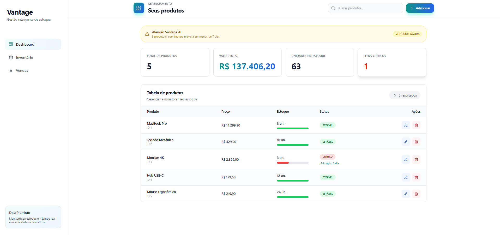
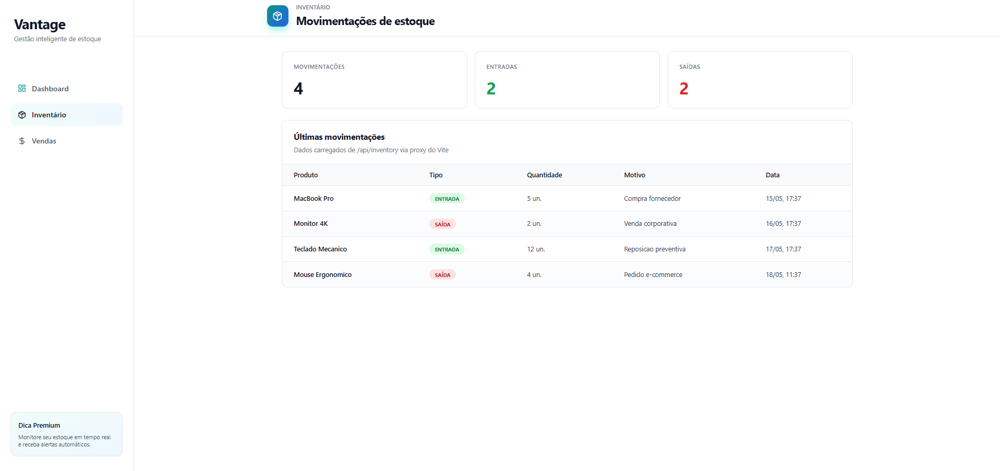
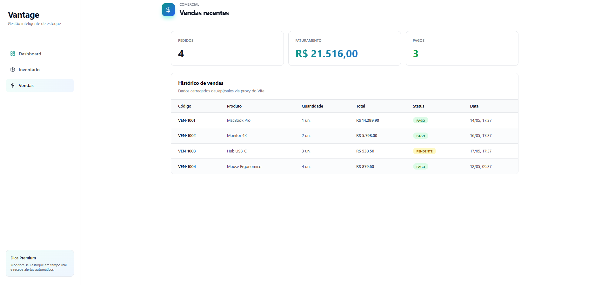
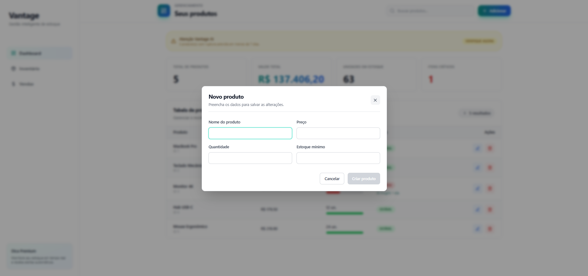

# Vantage ERP

Vantage ERP is a full stack inventory management platform built to feel like a real SaaS product: fast to run, easy to evaluate, and structured with production concerns in mind.

It combines a Java 21 + Spring Boot 3.3 backend with a React + Vite frontend, delivering product management, inventory visibility, sales monitoring, validation, API error handling, and predictive stock insights through the Vantage AI module.

## Zero Friction Demo

On Windows, run the whole stack with one command:

```bash
./start-all.bat
```

The script starts:

- Backend: `http://localhost:8080`
- Frontend: `http://localhost:5173`

The application already seeds demo products on startup, so reviewers can test the dashboard without creating data manually.

## Product Screens

### Dashboard

The main dashboard shows product KPIs, stock health, critical alerts, and the Vantage AI prediction for products close to depletion.



### Inventory

The inventory view tracks recent stock movements, separating inbound and outbound operations for operational visibility.



### Sales

The sales view summarizes orders, revenue, paid transactions, and recent commercial activity.



### Add Product

The product modal keeps creation and editing focused, with validation-ready fields for price, quantity, and minimum stock.



## Why It Matters

Most inventory systems only show what is already happening. Vantage ERP also highlights what is about to happen.

The Vantage AI feature analyzes current stock versus minimum stock levels and estimates how many days remain before a product runs out. For example, if the Monitor 4K is already below the safe threshold, the dashboard surfaces an alert such as "1 dia" instead of leaving the manager to discover the risk manually.

That turns the product from a CRUD screen into a decision-support tool for purchasing, stock replenishment, and operational planning.

## Architecture

### Backend

- Java 21
- Spring Boot 3.3
- Spring Web
- Spring Data JPA
- Bean Validation
- H2 for local development
- PostgreSQL/Supabase-ready production profile
- Java Records for lightweight API response DTOs
- Centralized exception handling with `@RestControllerAdvice`
- OpenAPI/Swagger documentation support

### Frontend

- React
- Vite
- Tailwind CSS
- Axios
- Lucide React icons
- Vite dev proxy from `/api` to `http://localhost:8080`
- Responsive dashboard with desktop tables and mobile cards

### Runtime Profiles

The backend is split by Spring profile:

- `application-dev.properties`: local H2 setup, no `.env` required
- `application-prod.properties`: PostgreSQL/Supabase setup through environment variables
- `application.properties`: defaults to `spring.profiles.active=dev`

For production, provide:

```env
SPRING_DATASOURCE_URL=jdbc:postgresql://...
SPRING_DATASOURCE_USERNAME=...
SPRING_DATASOURCE_PASSWORD=...
```

## Main Features

- Product CRUD with validation
- Stock health dashboard
- Critical inventory alerts
- Vantage AI stock depletion forecast
- Inventory movements view
- Sales dashboard view
- API connection health feedback
- User-friendly error messages and toast notifications
- One-command local startup

## API Overview

- `GET /api/products`
- `POST /api/products`
- `PUT /api/products/{id}`
- `DELETE /api/products/{id}`
- `GET /api/products/{id}/predict`
- `GET /api/products/forecast-summary`
- `GET /api/inventory`
- `GET /api/sales`

Inventory and Sales currently return intentional MVP mock data. The controllers are marked with TODO comments to make the technical debt explicit and ready for the next production sprint, where those endpoints should be backed by JPA repositories.

## Manual Setup

### Backend

```bash
cd backend/erp
./mvnw spring-boot:run
```

### Frontend

```bash
cd frontend
npm install
npm run dev
```

The frontend can call the API through `/api` locally because Vite proxies requests to the Spring Boot server.

## Validation Checklist

- Try creating a product with an invalid name.
- Try setting a negative price or stock quantity.
- Reduce a product below its minimum stock level and watch the critical state appear.
- Open Inventory and Sales from the sidebar to confirm the secondary views load through the API.

## Author

Matheus Goes - Full Stack Developer focused on business software, data-driven workflows, and pragmatic product engineering.
